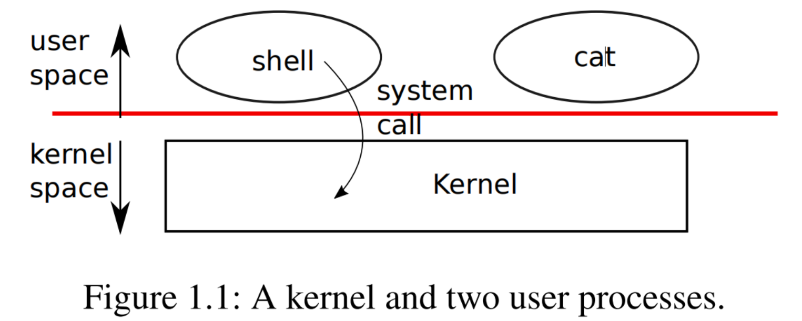
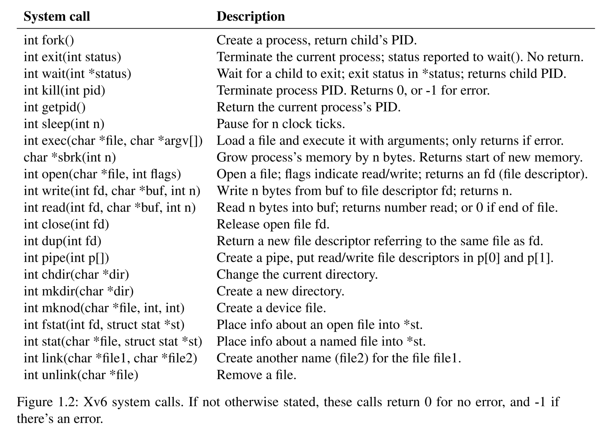
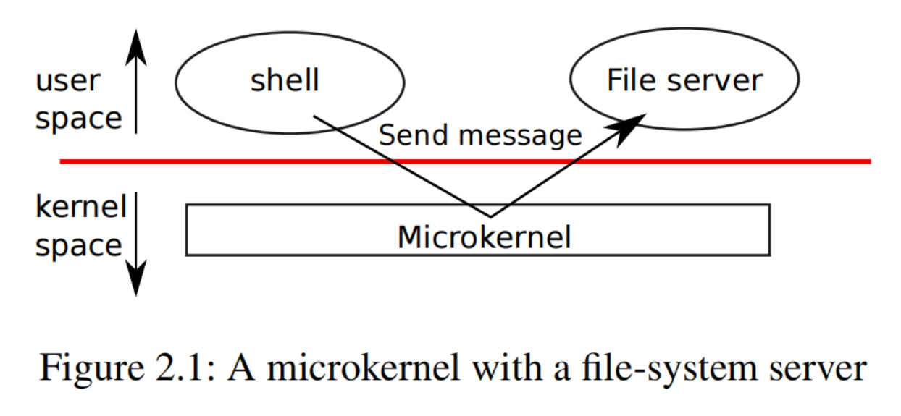
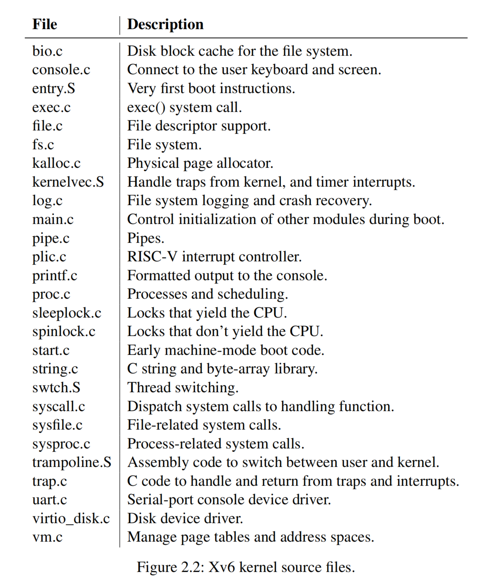
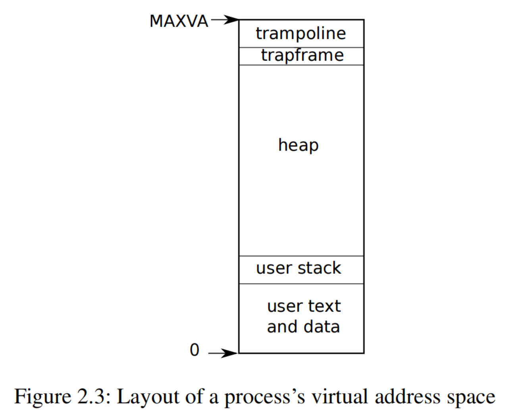
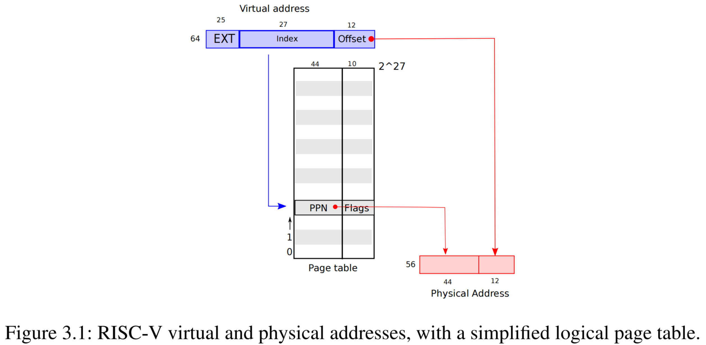
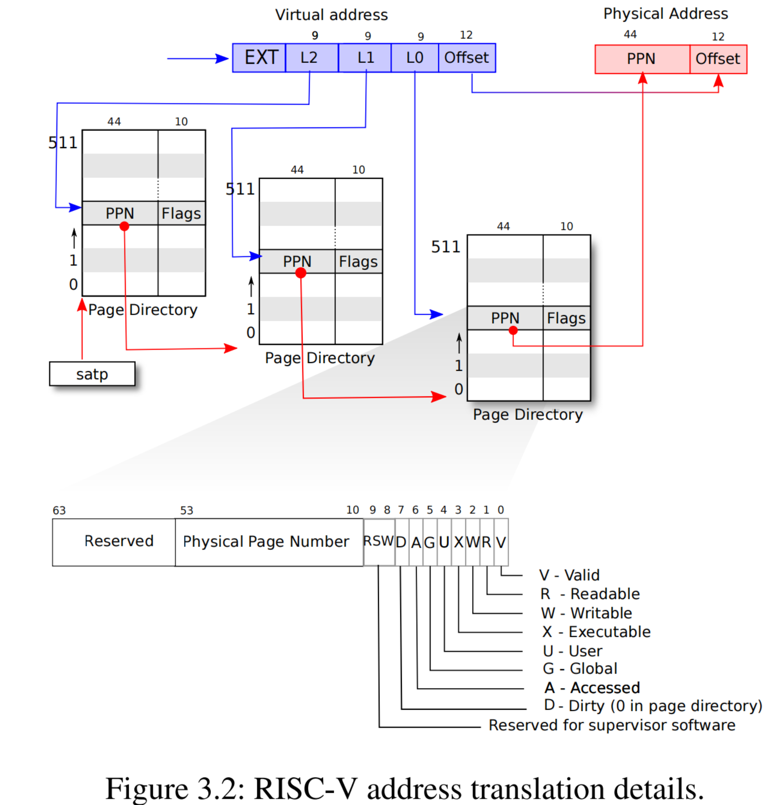
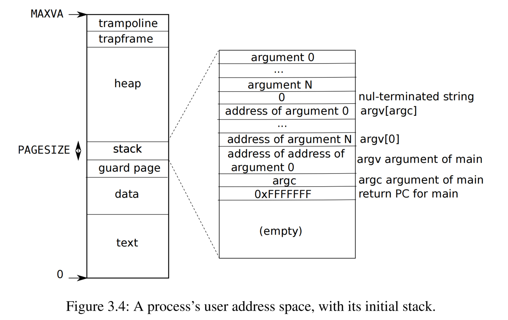

xv6 项目地址： https://github.com/mit-pdos/xv6-riscv

# 一、操作系统接口

操作系统的作用是在同一台电脑上运行多种程序，并且提供一个比起硬件本身提供的更加有效的指令集。操作系统操控并抽象了底层硬件，这样的话，比如说，一个单词处理程序就不需要关心它使用的是哪种磁盘硬件。操作系统让多种程序运行在硬件上，这样它们就可以同时运行（或者看起来好像同时运行）。最后，操作系统还提供了程序交互的控制方法，这样它们就可以分享数据，或者一起工作。

操作系统通过接口给用户的程序提供服务。设计一个好的接口看起来很困难。一方面，我们想要接口变得简单且简短，因为更容易正确实现。另一方面，我们可能希望提供给应用许多精密的功能。权衡这个问题的技巧是，设计的接口只基于很少的一些机制，而这些机制的组合可以提供极大的通用性。

这本书用一个操作系统作为一个具体的例子，阐述操作系统的概念。这个操作系统，xv6，提供了由 Ken Thompson 和 Dennis Ritchie 开发的 UNIX 操作系统的基础的接口，以及模拟了 UNIX 的内部设计。UNIX 提供了简短的接口，它们的机制可以很好地组合起来，提供令人惊讶的通用性。这个接口已经非常成功，所以现代的操作系统，如 BSD、Linux、macOS、Solaris，即使是微软的 Windows，都使用了 Unix-like 的接口。理解 xv6 是理解任何一个这些操作系统，以及许多其他的操作系统的很好的开始。



如图 1.1 所示，xv6 使用了内核（kernel）的传统形式，一个特殊的程序，提供了运行程序的服务。每个运行的程序都叫做一个进程（process），都有存储，包括指令、数据，以及一个栈。指令实现了程序的计算，数据是这些计算所使用的变量，栈组织了一个程序的进程调用。一个给定的计算机一般都有许多进程，但只有一个内核。

当一个进程需要唤醒内核时，它会唤醒一个系统调用（system call），一个操作系统接口的调用。系统调用进入内核，内核提供服务并返回。这样进程就在用户空间（user space）和内核空间（kernel space）之间交互执行。

内核使用了由 CPU 提供的硬件保护机制，以确保每个执行在用户空间的进程只会接触到它自己的内存。内核的执行使用硬件权限确保这些保护机制的实现，用户的程序执行则没有这些权限。当用户的程序唤醒系统调用时，硬件就提升权限等级，开始执行在内核里预先安排的函数。

内核提供的系统调用集是用户的程序看到的接口。xv6 内核提供了 UNIX 内核传统提供的服务和系统调用的一个子集。图 1.2 列出了所有的 xv6 系统调用。



这一章的余下部分概括了 xv6 的服务，包括进程、内存、文件描述符、管道、文件系统，并且使用代码片段说明了它们，以及讨论了 UNIX 的用户接口控制台（shell）如何使用它们。shell 对系统调用的使用说明了它们是如何精心设计的。

shell 是一个普通的程序，读取来自用户的指令并执行。事实上，shell 是一个用户程序，而不是内核的一部分，这说明了系统调用接口的能力：shell 没什么特别的。这也意味着，shell 可以轻易地替换，其结果是，现代的 UNIX 系统有许多种不同的 shell 可供选择，每个都有着它们自己的用户接口和描述符。xv6 shell 是一个 UNIX Bourne shell（bash）精髓的简单实现，它的实现可以参考 https://github.com/mit-pdos/xv6-riscv/blob/riscv//user/sh.c 。

## 1.1 进程和内存

xv6 进程由用户空间内存（指令、数据、栈）和独属于内核的每个进程的状态组成。xv6 时间共享（time-shares）进程：它显式地在等待执行的进程之间切换可用的 CPU。当一个进程不在执行时，xv6 就保存它的 CPU 寄存器，当它下次执行这个进程时再恢复它们。内核给每个进程都分配了一个进程标识符（PID）。

一个进程可能会使用`fork`系统调用创建新的进程。`fork`会创建一个新进程，称为子进程（child process），带有和调用进程（父进程，parent process）完全相同的内存。`fork`在父进程和子进程都返回。在父进程中，`fork` 返回子进程的 PID；在子进程中，`fork` 返回 0。例如，考虑到下面的用 C 语言写的程序片段：

```c
int pid = fork();
if (pid > 0) {
    printf("parent: child=%d\n", pid);
    pid = wait((int *) 0);
    printf("child %d is done\n", pid);
} else if (pid == 0) {
    printf("child: exiting\n");
    exit(0);
} else {
    printf("fork error\n");
}
```

`exit`系统调用会导致调用的程序停止执行来释放资源，例如内存和开放的文件。`exit`接收一个整数状态参数，一般来说，0 表示成功退出，1 表示失败。`wait`系统调用返回当前进程的退出的（或杀死的）子进程的 PID，并把子进程的退出状态拷贝到传递给`wait`的地址。如果调用程序的子进程没有退出的，`wait`就会等待某个子进程的退出。如果调用程序没有子进程，`wait`就立刻返回 -1。如果父进程不关心子进程的退出状态，可以传递一个 0 地址给`wait`（即`wait((int *) 0)`）。

在这个例子中，这两行输出

```
parent: child=1234
child: exiting
```

可能是任意顺序的，取决于是父进程还是子进程第一个接收到`printf`调用。在子进程退出后，父进程的`wait`就返回，导致父进程输出

```
child 1234 is done
```

尽管子进程和父进程最开始有着相同的内存，但父进程和子进程执行中有着不同的内存和不同的寄存器：改变其中某个的一个变量不会影响另一个。例如，当`wait`的返回值存储到父进程的`pid`变量时，不会改变子进程的`pid`变量。子进程的`pid`变量依旧是 0。

`exec`系统调用会用一个新的内存映像替换调用进程的内存，这个内存映像是从存储在文件系统的一个文件加载进来的。这个文件必须是一个特定的格式，它指定了这个文件的哪个部分保存了指令，哪个部分是数据，从哪个指令开始执行，等等。xv6 使用 ELF 格式，第三章再详细讨论。当`exec`成功时，它不是返回到调用程序，而是从文件加载指令，然后开始在 ELF 头部中声明的入口点执行。`exec`接收两个参数：包含了可执行程序的文件名，和一个字符串参数数组。例如：

```c
char *argv[3];
argv[0] = "echo";
argv[1] = "hello";
argv[2] = 0;
exec("/bin/echo", argv);
printf("exec error\n");
```

这个代码段用一个带有参数列表`echo`、`hello`的程序实例`/bin/echo`替换了调用程序。大多数程序都会忽略参数列表的第一个元素，这一般指的是程序名。

xv6 shell 使用上面那些调用代表用户运行程序。shell 的主要结构很简单，参考`main` （`sh.c`第 145 行） 。主循环使用`getcmd`读入一行来自用户的输入。之后调用`fork`，创建一个 shell 进程的拷贝。父进程调用`wait`，子进程运行命令。例如，如果用户给 shell 输入了`echo hello`，`runcmd`就会被调用，参数为`echo`、`hello`。`runcmd` （`sh.c`第 58 行）运行实际的命令。对于`echo`、`hello`，它会调用`exec` （`sh.c`第 78 行）。如果`exec`成功，子进程就会从`echo`执行指令，而不是`runcmd`。在某个点，`echo`会调用`exit`，这会导致父进程从`wait`中返回到`main` （`sh.c`第 145 行）。

你可能会疑惑，为什么`fork`和`exec`不组合成一个简单的调用，我们以后就会明白，shell 在实现 I/O 重定向时使用了这种分离。为了避免创建一个拷贝进程并立刻用`exec`替换掉它造成的浪费，操作系统内核在这种情况下，使用虚拟内存技术，例如写时拷贝（copy-on-write）优化了`fork`的实现。

xv6 隐式地分配了大多数用户空间内存：`fork`分配了子进程所需的父进程内存拷贝的内存，`exec`分配了足够的内存以支持可执行文件。一个在运行时需要更多内存（例如`malloc`）的进程可以调用`sbrk(n)`使它的数据内存扩充`n`字节，`sbrk`会返回新内存的位置。

## 1.2 I/O 和文件描述符

文件描述符（file descriptor）是一个小整数，代表了一个内核处理的对象，这个对象可供进程读写。进程可能通过打开一个文件、目录或设备，或者创建管道，或者拷贝一个现成的文件描述符，来获取文件描述符。简化起见，我们往往把文件描述符指向的对象称为“文件”。文件描述符接口抽象掉了文件、管道、设备之间的不同之处，使它们都看起来像字节流。我们把输入输出称为 I/O。

在内部，xv6 内核使用文件描述符作为每个进程表的索引，所以每个进程都有一个从 0 开始的文件描述符的私有空间。一般，一个进程从文件描述符 0 读取（标准输入），给文件描述符 1 写入（标准输出），给文件描述符 2 写入错误信息（标准错误）。我们将会看到，shell 使用这种一般方式实现 I/O 重定向和管道。shell 确保它始终有三个打开的文件描述符（`sh.c`第 151 行），这是默认的控制台文件描述符。

`read`和`write`系统调用逐字节读取，或逐字节写入通过文件描述符指定的打开的文件。调用`read(fd,buf,n)`从文件描述符`fd`中读取最多`n`字节，并拷贝到`buf`中，然后返回实际读取的字节数。每个指向文件的文件描述符都有一个关联的偏移量。`read`从当前的文件偏移量中读取数据，然后把这个偏移量推进所读取的字节数：后续的`read`会返回第一个`read`返回的字节数之后的字节数。当没有更多字节可供读取时，`read`会返回 0，表示文件末尾。

调用`write(fd,buf,n)`会从`buf`到文件描述符`fd`写入`n`个字节，然后返回实际写入的字节数。只有在出错时才会写入少于`n`个字节。和`read`一样，`write`在当前的文件偏移量上写入数据，然后把这个偏移量推进所写入的字节数：每次`write`都从上一次停止的地方开始写起。

下面的程序段（程序`cat`的精髓）从它的标准输入拷贝数据，输出到它的标准输出。如果出错，它会把信息写入标准错误。

```c
char buf[512];
int n;
for(;;){
    n = read(0, buf, sizeof buf);
    if (n == 0)
        break;
    if (n < 0) {
        fprintf(2, "read error\n");
        exit(1);
    }
    if (write(1, buf, n) != n) {
        fprintf(2, "write error\n");
        exit(1);
    }
}
```

在这个代码段中，需要记住的重要的事情是，`cat`不知道它正在读取的是来自文件，控制台，还是管道。相似地，`cat`也不知道它写入的是控制台，文件，还是什么别的。使用文件描述符，以及文件描述符 0 表示输入、文件描述符 1 表示输出的习惯，使得`cat`的实现变得非常简单。

`close`系统调用释放一个文件描述符，使它可以随意被未来的`open`、`pipe`、或者`dup`系统调用（见下方）重新使用。一个新分配的文件描述符往往是当前进程中数值最小的、未使用的文件描述符。

文件描述符和`fork`之间的交互使得 I/O 重定向很容易实现。`fork`把父进程的文件描述符拷贝到它自己的内存中，这样子进程一开始就有了和父进程完全相同的打开的文件。系统调用`exec`替换了调用进程的内存，但保留了它的文件表。这个行为使得 shell 实现了 I/O 重定向，只需要创建分支子程序，重新在子进程中打开选择的文件描述符，然后调用`exec`运行新程序。这是一个简化版本的运行命令`cat < input.txt`的 shell 代码：

```c
char *argv[2];
argv[0] = "cat";
argv[1] = 0;
if(fork() == 0) {
    close(0);
    open("input.txt", O_RDONLY);
    exec("cat", argv);
}
```

在子进程关闭了文件描述符 0 后，`open`就能使用这个文件描述符打开新的`input.txt`：0 就会是最小可用的文件描述符。之后`cat`的执行就用文件描述符 0（标准输出）指向`input.txt`。父进程的文件描述符不会被这段代码改变，因为它只更改子进程的文件描述符。

在 xv6 shell 中的 I/O 重定向代码就是以这种方式工作的（`sh.c`第 82 行）。记住，在这个代码点上，shell 已经分支了子进程，`runcmd`会调用`exec`，以加载新的程序。

`open`的第二个参数由一系列的标志位组成，用比特流表示，控制了`open`的行为。可能的取值都定义在文件控制（fcntl）头文件（ https://github.com/mit-pdos/xv6-riscv/blob/riscv//kernel/fcntl.h#L1-L5 ）：`O_RDONLY`、`O_WRONLY`、`O_RDWR`、`O_CREATE`、以及`O_TRUNC`，它们引导`open`打开文件以供读、写、即读又写、创建不存在的文件、截断文件到 0 长度。

现在，分离`fork`和`exec`这两种调用会很有用的原因就很清晰了：在这两种调用之间，shell 有机会重定向子进程的 I/O，而不影响主 shell 的 I/O 设置。你可以想象存在一种假设混合的`forkexec`系统调用，但选择使用这种调用进行 I/O 重定向似乎非常麻烦。shell 需要在调用`forkexec`之前修改自己的 I/O 设置（然后撤销这些修改）；或者`forkexec`可以接收 I/O 重定向指令作为参数；或者（最麻烦的方法）每个程序例如`cat`都设计自己的 I/O 重定向机制。

尽管`fork`拷贝了文件描述符表，但在父进程和子进程之间，背后的每个文件偏移量都是共享的。考虑到这个例子：

```c
if(fork() == 0) {
    write(1, "hello ", 6);
    exit(0);
} else {
    wait(0);
    write(1, "world\n", 6);
}
```

这个代码段的最后，文件标识符 1 所指向的文件会包含`hello world`的数据。父进程的`write`（因为`wait`的存在，只会在子进程结束后运行）接着子进程的`write`离开的地方写入。这种行为有助于程序依次从 shell 命令序列里输出，例如`(echo hello; echo world) >output.txt`。

`dup`系统调用复制了一个存在的文件描述符，返回一个新的文件描述符，指向同一个背后的 I/O 对象。两个文件描述符有着同样的偏移量，正如通过`fork`进行了文件描述符拷贝一样。这是把`hello world`写入一个文件的另一种方法：

```c
fd = dup(1);
write(1, "hello ", 6);
write(fd, "world\n", 6);
```

如果两个文件描述符源于相同的原始文件描述符（通过一系列的`fork`和`dup`调用），那么它们就有相同的偏移量。否则文件描述符就不共享偏移量，即使它们是源于指向同一个文件的`open`调用。`dup`使得 shell 可以实现类似这样的命令:`ls existing-file non-existing-file >tmp1 2>&1`。这里的`2>&1`告诉 shell，给命令一个文件描述符 2，这是文件描述符 1 的拷贝。无论是存在的文件名，还是不存在文件的错误信息，都会显示在文件`tmp1`里。xv6 shell 不支持错误文件描述符的 I/O 重定向，但现在你就知道如何实现了。

文件描述符是一个强大的抽象，因为它们隐藏了它们连接了什么东西的细节：一个进程写入文件描述符 1 的可能是写入一个文件，写入一个设备例如控制台，或者写入一个管道。

## 1.3 管道

管道（pipe）是一个暴露给进程的小段内核缓冲区，作为一对文件描述符，一个用于读，另一个用于写。在管道的一端写入数据会使得数据可以从管道另一端读出。管道提供了一种进程间通信的方式。

下面的实例代码运行了程序`wc`，其标准输入连接到了管道的读端：

```c
int p[2];
char *argv[2];

argv[0] = "wc";
argv[1] = 0;

pipe(p);
if (fork() == 0) {
    close(0);
    dup(p[0]);
    close(p[0]);
    close(p[1]);
    exec("/bin/wc", argv);
} else {
    close(p[0]);
    write(p[1], "hello world\n", 12);
    close(p[1]);
}
```

这段程序调用了`pipe`，创建了一个新的管道，并把读和写文件描述符记录在数组`p`里。在`fork`后，父进程和子进程都有了指向这个管道的文件描述符。子进程调用`close`，然后`dup`，使得文件描述符 0 指向了管道的读端，关闭了`p`记录的文件描述符，然后调用`exec`运行`wc`。当`wc`从它的标准输入读入时，它就会从管道中读入。父进程关闭了管道的读端，写入管道，之后关闭了写端。

如果没有可用的数据，在管道上调用`read`会导致等待：要么有数据写入，要么所有的指向这个管道写入端的文件描述符都关闭了；在后一种情况下，`read`会返回 0，就好像到达了文件的末尾。之所以`read`直到不可能有新的数据到达之前会一直阻塞，其中一个原因是，对于子进程来说，在执行上面的`wc`之前先关闭管道的写端是非常重要的：如果某一个`wc`的文件描述符指向了管道的写端，`wc`就永远看不到文件的末尾。

xv6 shell 实现了管道，例如`grep fork sh.c | wc -l`，执行了类似于上面的代码的行为（`sh.c`第 100 行）。子进程创建了一个管道，连接了管道的左右两端。之后它为管道的左端调用`fork`和`runcmd`，又为右端调用`fork`和`runcmd`，然后等待两个都结束。管道的右端可能是一个指令，它自己本身也包含一个管道（例如`a | b | c`），它自己分支出两个新的子进程（一个给`b`，一个给`c`）。以这种方式，shell 能创建一个进程树。这个树的叶子都是命令，内部的节点都是程序，等待着左端和右端的子进程完成。

理论上，可以有内部节点运行管道的左端，但正确地这么做会把实现变得复杂。考虑做出如下调整：把`sh.c`改为不为管道的左端创建分支，而是在内部节点运行`runcmd(p->left)`。这样，例如，`echo hi | wc`不会产生输出，因为当`echo hi`在`runcmd`中退出时，内部进程就会退出，永远不会调用分支来运行管道的右端。这种错误的行为可以通过在内部进程的`runcmd`里不调用`exit`来解决，但这种解决办法会使代码更加复杂：现在`runcmd`就需要知道它是否是一个内部节点。如果不为`runcmd(p->right)`创建新的分支，代码也会更复杂。例如，调整为`sleep 10 | echo hi`将会立刻输出`hi`，而不是等待 10 秒，因为`echo`立刻运行并退出，不会等待`sleep`退出。因为`sh.c`的目标是尽可能简单，所以它不会去努力防止创建内部进程。

管道看起来可能不比临时文件更强大：例如

```bash
echo hello world | wc
```

可以不用管道实现，即

```bash
echo hello world >/tmp/xyz; wc </tmp/xyz
```

但管道在这种情况下比起临时文件至少有四个优势。第一，管道能自动清理自己；而在文件重定向时，shell 必须自己记住要在完成后删除 `/tmp/xyz`。第二，管道可以传输任意长的数据流，然而文件重定向需要足够的磁盘剩余空间来存储所有的数据。第三，管道使得管道两端可以并行执行，然而文件方式要求第一个程序结束后，第二个程序才能开始。第四，如果你要实现进程间通信，管道阻塞能读写，这比起文件的无阻塞语义更加高效。

## 1.4 文件系统

xv6 文件系统提供了数据文件（包含了人类无法理解的字节数组），以及目录（包含了数据文件和其他目录的命名指针）。目录形成了一个树，从一个特殊的称为根目录（root）的目录开始。一个路径（path）例如`/a/b/c`指向了一个在根目录`/`下叫`a`的目录下叫`b`的目录下叫`c`的文件或目录。不以`/`开头的路径表示相对于调用进程的当前目录（current directory），这可以通过`chdir`系统调用进行修改。下面这两种代码段打开的是相同的文件：

```c
chdir("/a");
chdir("b");
open("c", O_RDONLY);
```

```c
open("/a/b/c", O_RDONLY);
```

第一个代码段把进程的当前目录修改为`/a/b`；第二个代码段既没有指向也没有改变进程的当前目录。

有几种系统调用可以创建新文件和目录：`mkdir`创建一个新目录，带有`O_CREATE`标志的`open`调用创建一个新数据文件，`mknod`创建一个新的设备文件。下面的例子展示了这三个用法：

```c
mkdir("/dir");
fd = open("/dir/file", O_CREATE|O_WRONLY);
close(fd);
mknod("/console", 1, 1);
```

`mknod`创建了一个特殊的文件，它指向的是一个设备。与设备文件关联的是主设备号和次设备号（`mknod`的两个参数），它们唯一标识了一个内核设备。当进程之后打开一个设备文件时，内核会把`read`和`write`系统调用转接到这个内核设备上，而不是传递给文件系统。

文件名不同于文件本身；背后的同一个文件（称为索引节点，inode）可以有多个名字（称为链接，link）。每个链接由目录里的一个实体构成；这个实体包含了一个文件名和一个指向某个索引节点的指针。一个索引节点包含了一个文件的元数据（metadata），包括它的类型（文件、目录或设备），长度，文件内容在磁盘的位置，以及这个文件的链接数。

`fstat`系统调用可以从指向某个文件描述符的索引节点中获取信息。这些信息会保存在一个结构体`struct stat`里，定义在`stat.h`里（ https://github.com/mit-pdos/xv6-riscv/blob/riscv//kernel/stat.h ）：

```c
#define T_DIR 1 // Directory
#define T_FILE 2 // File
#define T_DEVICE 3 // Device
struct stat {
    int dev; // File system’s disk device
    uint ino; // Inode number
    short type; // Type of file
    short nlink; // Number of links to file
    uint64 size; // Size of file in bytes
};
```

`link`系统调用创建另一个文件系统名，指向和某个已经存在的文件的相同的索引节点。这个代码段创建了一个新的文件，其名称既是`a`又是`b`：

```c
open("a", O_CREATE|O_WRONLY);
link("a", "b");
```

对`a`读写就相当于对`b`读写。每个索引节点都由一个唯一的索引节点编号（inode number）唯一标识。在上面的代码执行后，可以认为`a`和`b`背后指向了相同的内容，通过查看`fstat`的结果就能确定：都会返回相同的索引节点编号（ino），并且`nlink`的计数也会设置为 2。

`unlink`系统调用会从文件系统中移除一个文件名。文件的索引节点以及磁盘空间只会在文件的链接数为 0，且没有指向它的文件描述符时才会释放。因此，在上面的代码段执行后，再执行

```c
unlink("a");
```

仍然会留下索引节点，文件内容可以通过`b`访问。此外，

```c
fd = open("/tmp/xyz", O_CREATE|O_RDWR);
unlink("/tmp/xyz");
```

是一种惯用方法。它创建了一个临时的索引节点，但没有文件名，因此当进程关闭`fd`或退出时，就会自动清理。

UNIX 提供了文件的使用，可以通过 shell 作为用户层面的程序调用。例如`mkdir`，`ln`，以及`rm`。这种设计使得任何人都可以通过增加新的用户层程序来扩展命令行的接口。事后看来，显然就该这么设计，但和 UNIX 同时期的其他系统经常把这样的命令内置到 shell 里（也经常会把 shell 内置到内核里）。

一个例外是`cd`，这是内置在 shell 里的（`sh.c`第 160 行）。`cd`必须能修改 shell 自己的当前工作目录。如果`cd`作为一个常规命令运行，shell 就会分支出一个子进程，子进程运行`cd`，`cd`就只会修改子进程的工作目录，而父进程（例如 shell）的工作目录就不会修改。

## 1.5 现实世界

UNIX 对“标准”文件描述符、管道，以及十分方便地执行这些操作的 shell 语法的结合，获得了写出用途广泛的可重复利用的程序的巨大优势。这种思想激发了“软件工具”的文化，很大程度上归功于 UNIX 的强大和人气，shell 也是第一种所谓的“脚本语言”。UNIX 系统调用接口直到现在也存在于诸如 BSD、Linux、Mac OS X 的系统中。

UNIX 系统调用接口通过可移植操作系统接口标准（POSIX）进行了标准化。xv6 并不满足 POSIX 标准：它缺少许多系统调用（包括一些基本调用，例如`lseek`），而且它提供的许多系统调用和标准并不相同。我们 xv6 的主要目标是简洁和清晰地提供一个简单的 UNIX-like 系统调用接口。一些人使用更多的系统调用和简单的 C 库拓展了 xv6，以便运行基本 UNIX 程序。然而，现代内核比起 xv6 提供了多得多的系统调用，以及多得多的内核种类。例如，它们支持网络，窗口系统，用户层线程，许多设备的驱动，等等。现代内核持续飞速进化，提供了远超 POSIX 标准的特性。

UNIX 使用一种文件名和文件描述符接口，统一了接入多种资源（文件、目录、设备）。这种思想可以拓展到更多种资源；一个很好的例子是 Plan 9 系统，它把”资源即文件“的概念运用在网络、绘图等中。然而，大多数源于 UNIX 的操作系统并没有一直走这条道路。

文件系统和文件描述符是非常强大的抽象。即便如此，操作系统接口也有其他的模型。Multics，UNIX 的前身，抽象了文件存储，使其看起来像是内存，产生了一种非常不同的接口风格。Multics 设计的复杂性直接影响了 UNIX 的设计者，因此他们努力把这些构建得更简单。

xv6 没有提供用户的概念或保护某个用户不受其他用户影响；在 UNIX 语境下，所有的 xv6 进程都是在 root 下运行的。

这本书说明了 xv6 如何实现它 UNIX-like 的接口，但这种思想和概念可以应用到远不止 UNIX 上。任何操作系统必须能在其背后的硬件上运行多种进程，使进程彼此分离，提供控制进程间通信的机制。在学习 xv6 后，你应该能够看懂别的、更加复杂的操作系统，理解 xv6 背后的概念同样也存在于那些系统中。

## 1.6 练习

1. 使用 UNIX 系统调用写一个程序，在两个进程之间，基于每个方向一个的一对管道，“乒乓”一个字节。使用每秒的交互数来衡量程序的性能。

# 二、操作系统结构

操作系统的关键需求是同时支持多种活动。例如，使用第一章描述的系统调用接口，一个进程可以通过`fork`开始一个新进程。操作系统必须基于时间在多个进程间分配电脑资源，例如，即使进程的数量比 CPU 硬件数量还多，操作系统也必须安排好进程之间的“隔离”。也就是说，如果一个进程有 bug 或者故障，它也不应该影响到不依赖这个出错的进程的其他进程。然而，完全隔离也不应该，因为应该允许进程之间的有意交互；管道就是一个例子。因此，一个操作系统必须满足三个要求：多进程复用，隔离，以及交互。

这一章对于操作系统如何组织，并完成这三个要求给出了一个概述。事实上有许多种方式能完成这个要求，但这一章会专注于主流的围绕着宏内核（monolithic kernel）的设计，这种设计被许多 UNIX 操作系统采用。这一章也会提供一个 xv6 进程——xv6 隔离单元的概述，这是 xv6 启动时创建的第一个进程。

xv6 运行在一个多核（multi-core）的 RISC-V 微处理器上，xv6 的大多数底层功能（例如进程的实现）是特定于 RISC-V 的。RISC-V 是一个 64 位的 CPU，xv6 是用“LP64”C 语言编写的，意味着在 C 语言中长整型（L）和指针（P）是 64 位宽的，而整型是 32 位宽的。这本书假设读者在某些架构上做过一些机器层面的编程，并且会在 RISC-V 出现时引入特定于 RISC-V 的概念。一个有用的 RISC-V 参考是《The RISC-V Reader: an open architecture Atlas》，用户层 ISA 和权限架构是官方规范。

完整计算机上的 CPU 围绕着支持的硬件，大多数都服从 I/O 接口。支持 xv6 的硬件是通过 QEMU 的“-machine virt”选项模拟的。这包括 RAM，一个包括启动代码的 ROM，一系列和用户键盘以及屏幕的连接，以及一个存储磁盘。

## 2.1 抽象物理资源

当涉及到操作系统时，有人会问的第一个问题是，为什么需要操作系统？也就是说，应用也可以当成一个库来连接实现图 1.2 中的系统调用。在这种设计里，甚至每个应用都可以拥有自己量身定做的库。应用可以直接和硬件资源交互，用对应用来说最好的方式使用那些资源（例如实现高性能，或者可预测的性能）。一些嵌入式设备的操作系统或者实时系统就是以这种方式组织的。

这种库方式的缺陷在于，如果有多个应用运行，这些应用必须得表现良好。例如，每个应用必须周期性地放弃占用 CPU，以便其他应用运行。这样一个“合作”时分设计只在所有的应用都彼此信任，并且不存在 bug 时才能实现。大多数情况下，应用并不信任彼此，并且存在 bug。所以需要比合作设计提供更大的隔离性。

为了实现强隔离，应该禁止应用直接访问敏感的硬件资源，而是把这些资源抽象成服务。例如，UNIX 应用只能通过文件系统的`open`、`read`、`write`和`close`系统调用，才能和内存交互，而不是直接读取写入磁盘。它给应用提供了方便的路径名，允许操作系统（作为接口的实现者）来管理磁盘。即使并不关心分离性，有意交互的程序（或仅仅希望彼此不挡路）也很可能会认为文件系统是比起直接使用磁盘更加方便的抽象。

类似的，UNIX 透明地在多个进程之间交换硬件 CPU，需要时保存和恢复寄存器状态，以便应用不必关心时间共享。这种透明性允许操作系统分配 CPU，即使有些应用在死循环。

另一个例子是，UNIX 进程会使用`exec`来建立它们的内存映像，而不是直接和物理内存交互。这允许操作系统决定在内存中的哪里放置一个进程。如果内存紧张，操作系统甚至会把一个进程的部分数据存放在磁盘里。`exec`也给用户提供了方便的文件系统，以便存储可执行程序的映像。

在 UNIX 进程之间，许多种类的交互都是通过文件描述符发生的。文件描述符不仅抽象了许多细节（例如，在管道或文件里的数据存放在哪里），而且它们的定义方式简化了交互。例如，如果管道一端的一个应用崩了，内核就会给管道另一端的进程生成一个文件结束信号。

图 1.2 的系统调用接口是精心设计的，以便提供给程序员便利，也提供了强隔离的可能。UNIX 接口不是唯一抽象资源的方法，但结果证明是非常好的一种方法。

## 2.2 用户模式，管理模式，以及系统调用

强隔离需要应用和操作系统之间存在一个坚实的界限。如果应用出错了，我们不希望操作系统崩溃，或者其他应用也崩溃。相反，操作系统应该能够清理崩溃的应用，继续运行其他的应用。为了实现强隔离，操作系统必须安排应用不得修改（甚至读取）操作系统的数据结构和指令，不得获取其他进程的内存。

CPU 提供了强隔离的硬件支持。例如，RISC-V 有三种 CPU 执行指令的模式：机器模式（machine mode）、管理模式（supervisor mode）、用户模式（user mode）。在机器模式下的指令拥有完整的权限；CPU 在机器模式下启动。机器模式大多数情况下专为设置计算机才启用。xv6 在机器模式下执行几行之后就会切换到管理模式。

在管理模式下，CPU 可以执行权限指令（privileged instructions）：例如，启动和终止中断，读写保存了页地址的寄存器，等等。如果一个用户模式下的应用试图执行权限指令，CPU 不会执行这个指令，而是切换到管理模式，以便管理模式的代码能够终止这个应用，因为它做了它本不该做的事。第一章的图 1.1 展示了这个机制。一个只能执行用户模式指令（例如加起来两个数）的应用称为运行在用户空间（user space），然而运行在管理模式的软件也可以执行权限指令，被称为运行在内核空间（kernel space）。运行在内核空间（或者说在管理模式下）的软件称为内核。

一个试图唤醒内核函数（例如 xv6 的`read`系统调用）的应用必须转移到内核。CPU 提供了一个特殊的指令，把 CPU 从用户模式切换到管理模式，并从由内核指定的进入点进入内核。（RISC-V 提供了`ecall`指令实现这个功能。）一旦 CPU 切换到了管理模式，内核就可以验证系统调用的参数，决定应用是否能够执行所要求的操作，然后拒绝或执行。内核能控制转移到管理模式的进入点，这是非常重要的；如果应用可以决定内核的进入点，一个恶意应用就能够在参数验证被跳过的时间点进入内核。

## 2.3 内核组织

关键设计问题是，操作系统中的哪一部分应该运行在管理模式下。一种可能是，整个操作系统都放在内核，以便在管理模式下实现所有的系统调用。这种组织被称为宏内核（monolithic kernel）。

在这种组织下，整个操作系统运行都有完整的硬件权限。这种组织非常方便，因为操作系统设计者不需要决定哪一部分操作系统不需要完整的硬件权限。此外，这种组织对操作系统不同部分之间的协调也更容易。例如，操作系统可能有一个缓冲区缓存，可以同时被文件系统和虚拟内存系统共享。

宏内核组织方式的缺陷在于，操作系统不同部分之间的接口总是很复杂（我们将在本章的剩余部分看到），因此操作系统开发者很容易出错。在宏内核中，任何错误都是致命的，因为在管理模式中的错误往往会引起内核崩溃。如果内核崩溃了，计算机就会停止工作，所有的应用也都会崩。计算机就必须重新启动。

为了减少内核出错的风险，操作系统设计者可以最小化操作系统运行在管理模式中的代码，在用户模式下执行操作系统中的大部分代码。这种内核组织方式称为微内核（microkernel）。



图 2.1 说明了微内核的设计。在图中，文件系统作为用户层进程运行。作为进程运行的操作系统服务称为服务器。为了使得应用和文件系统交互，内核提供了一个进程间通信机制，从某个用户模式进程发送信息给另一个。例如，如果一个应用例如 shell 希望读写一个文件，它就会给文件服务器发送信息，然后等待回应。

在微内核里，内核接口由一些底层函数组成，例如启动应用、发送信息、获取设备硬件等。这种组织方式允许内核相对简单，因为大多数操作系统都放在了用户层面的服务里。

xv6 是作为宏内核实现的，就像大多数 UNIX 操作系统一样。因此，xv6 内核接口即操作系统接口，内核实现了完整的操作系统。因为 xv6 不提供许多服务，它的内核比起一些微内核还要小，但从概念上来说 xv6 确实是宏内核。

## 2.4 代码：xv6 组织方式

xv6 内核源码在`kernel/`子目录下。源码被分成文件，遵守了一个粗糙的模块化概念；图 2.2 列出了这些文件。模块之间的交互定义在`defs.h`（ https://github.com/mit-pdos/xv6-riscv/blob/riscv//kernel/defs.h ）中。



## 2.5 进程概述

在 xv6（以及其他 UNIX 操作系统）中隔离的单元是进程（process）。进程的抽象阻止了一个进程破坏或窃取其他进程的内存，CPU，文件描述符等。它也阻止了进程破坏内核自己，因此进程不会颠覆内核的隔离机制。内核必须小心实现进程的抽象，因为一个出错或恶意的进程可能欺骗内核或硬件，做一些不好的事（例如规避隔离）。内核使用的实现进程的机制包括用户/管理模式标记，地址空间，以及线程的时间切片。

为了帮助确保隔离，进程抽象提供给程序了一种它拥有整个机器的错觉。一个进程提供给程序的看起来是私有的内存系统，或者地址空间（address space），别的进程不能读写。进程也提供给程序看起来是它自己的 CPU，执行程序的指令。

xv6 使用页表（由硬件实现）给每个进程它自己的地址空间。RISC-V 页表转换（或者说“映射”）了一个虚拟地址（virtual address，RISC-V 指令所操作的地址）到物理地址（physical address，CPU 芯片发送给主内存的地址）。

xv6 给每个进程维护了一个分离的页表，定义了进程的地址空间。如图 2.3 所示，地址空间包括程序的用户内存（user memory），从虚拟地址 0 开始。最开始是指令，之后是全局变量，之后是栈，最后是“堆”区域（用于分配，malloc），进程可以按需扩展。有一些因素限制了进程的地址空间的上限：RISC-V 上的指针是 64 位宽的；当硬件在页表里查找虚拟地址时，只用了低 39 位；以及 xv6 只用了这 39 位中的 38 位。因此，最大地址是 $2^{38}-1=$ `0x3fffffffff` ，这就是`MAXVA`（kernel/riscv.h 第 348 行）。在内存空间顶端，xv6 保留了一个页作为“跳板”（trampoline），以及一个映射了进程的“陷阱框架”（trapframe）用于切换到内核，将会在第四章解释。



xv6 内核给每个进程都维护了许多状态，集成在了结构体`struct proc`里（kernel/proc.h 第 86 行）。进程最重要的内核状态就是它的页表，它的内核栈，以及它的运行状态。我们会使用`p->xxx`的符号指向`proc`结构体的元素；例如`p->pagetable`是一个指向进程的页表的指针。

每个进程都有一个执行线程（简称为线程，thread），执行程序的指令。一个线程可以被暂停，之后恢复。为了在进程之间透明切换，内核会暂停当前运行的线程，并恢复另一个进程的线程。线程的大多数状态（本地变量、函数调用返回地址）都存储在线程的栈里。每个进程都有两个栈：一个用户栈和一个内核栈（`p->kstack`）。当进程正在执行用户指令时，只用到了它的用户栈，它的内核栈是空的。当进程进入内核（进行系统调用或中断）时，内核代码就会在进程的内核栈上执行；当进程处于内核时，它的用户栈依旧含有保存的数据，但不可以被动态使用。一个进程的线程在动态使用用户栈和内核栈之间交替。内核栈是分离的（而且不受用户代码影响），因此内核可以执行，即使进程破坏了它的用户栈。

一个进程可以通过执行 RISC-V 的`ecall`指令进行系统调用。这个指令会提高硬件权限等级，把程序计数器切换内核定义的进入点。进入点的代码切换到内核栈，执行实现系统调用的内核指令。当系统调用完成时，内核切换回用户栈，通过调用`sret`指令返回到用户空间，降低硬件权限等级，在系统调用指令后就恢复执行用户指令。进程的线程可以在内核中“阻塞”以等待 I/O，当 I/O 完成时就会在它离开的点上恢复。

`p->state`表明进程已分配，准备运行，正在运行，等待 I/O，或者正在退出。

`p->pagetable`保存了进程的页表，以一种 RISC-V 硬件所特定的格式。在用户空间执行进程时，xv6 会使页表硬件使用进程的`p->pagetable`。进程的页表也记录物理页分配到存储进程内存的地址。

## 2.6 代码：开始 xv6 及第一个进程

为了使 xv6 更加具体，我们会概括一下内核是如何启动并运行第一个进程的。下面的章节会更加详细地描述在这个概括中出现过的机制。

当 RISC-V 计算机接通电源时，它自己先初始化，然后运行一个存储在只读内存的启动加载器。启动加载器把 xv6 内核加载到内存。之后，在机器模式下，CPU 执行了位于`_entry`的 xv6 启动代码（kernel/entry.S 第 6 行）。RISC-V 启动时，页表硬件不可用：因此虚拟地址直接映射到物理地址。

加载器把 xv6 内核加载到位于物理地址`0x80000000`的内存。它把内核放到`0x80000000`而不是`0x0`的原因是，从`0x0`到`0x80000000`的地址范围包括了 I/O 设备。

位于`_entry`的指令设置了一个栈，以便 xv6 运行 C 代码。xv6 声明了一个初始化的栈空间，`stack0`，在文件`start.c`（kernel/start.c 第 11 行）里。`_entry`的代码加载了栈指针寄存器`sp`，位于地址`stack0+4096`，即栈顶，因为 RISC-V 的栈是向下增长的。既然内核有一个栈，`_entry`就能调用位于`start`（kernel/start.c 第 21 行）的 C 代码。

`start`函数执行了一些只能在机器模式下进行的设置，就切换到管理模式。为了进入管理模式，RISC-V 提供了指令`mret`。这个指令主要用在从管理模式中的系统调用返回到机器模式。`start`不是从这样的调用中返回，而是把东西都设置好，就好像一直就在那里：它在寄存器`mastatus`中把之前的权限模式设置为管理模式，通过把`main`的地址写到寄存器`mepc`中把返回地址设置为`main`，通过把`0`写到页表寄存器`satp`使虚拟内存映射在管理模式下不可用，并且授权给监督模式所有的中断和异常。

在切换到管理模式之前，`start`还有一项任务：它编程了时钟芯片来产生时钟中断。做完这项工作，`start`通过调用`mret`“返回”到管理模式。这导致程序计数器切换到`main`（kernel/main.c 第 11 行）。

在`main`初始化了一些设备和子系统后，它通过调用`userinit`（kernel/proc.c 第 212 行）创建了第一个进程。第一个进程执行了一个小程序，写在 RISC-V 集成里的`initcode.S`（user/initcode.S 第 1 行），它通过唤醒`exec`系统调用重新进入内核。我们在第一章看到了，`exec`会把当前进程的内存和寄存器替换为一个新的程序（在这种情况下是`/init`）。一旦内核完成了`exec`，它就返回到`/init`进程的用户空间。如果需要的话，`init`（user/init.c 第 15 行）会创建一个新的控制台设备文件，作为文件描述符 0、1、2 打开。之后它在控制台上启动 shell。系统就启动了。

## 2.7 现实世界

在现实世界，宏内核和微内核都能找到。许多 UNIX 内核都是宏内核。例如，Linux 有一个宏内核，尽管一些操作系统函数是作为用户层服务器运行的（例如窗口系统）。像 L4，Minix，QNX 之类的内核设计为带有服务器的微内核，广泛应用在嵌入式系统上。

大多数操作系统都采用了进程的概念，大多数进程看起来都和 xv6 进程类似。然而现代操作系统支持一个进程里多个线程，允许一个进程使用多个 CPU。在一个进程里支持多线程涉及到许多 xv6 不具备的机制，包括潜在接口变化（例如 Linux 的`clone`，一种`fork`的变体），来控制多个进程共享进程的哪一方面。

## 2.8 练习

1. 你可以使用 gdb 观察最开始的内核到用户的切换。运行`make qemu-gdb`。在另一个窗口中，在同样的目录下，运行`gdb`。输入 gdb 命令`break *0x3ffffff10e`，在内核跳到用户空间的`sret`指令处设置一个断点。输入`continue`gdb 命令。gdb 会在断点停止，准备执行`sret`。输入`stepi`。gdb 现在会表示，它正在地址`0x0`处执行，这是在`initcode.S`开头处的用户空间。

# 三、页表

页表是操作系统提供给每个进程它自己的私有地址空间和内存的机制。页表决定了内存地址的意义，哪一部分的物理地址可以访问。它们允许 xv6 分隔不同的进程的地址空间，从而在单独一个物理内存中复用它们。页表也提供了某种迂回手段，使得 xv6 可以做一些小动作：在几个地址空间映射相同的内存（跳板页 trampoline page），或者用一个未映射的页保护内核和用户栈。本章的剩余内容解释了 RISC-V 硬件提供的页表，以及 xv6 如何使用它。

## 3.1 页表硬件

回顾一下，RISC-V 指令（用户和内核）操作的都是虚拟地址。而机器的 RAM，或者说物理内存，是由物理地址索引的。RISC-V 页表硬件连接了这两种地址，通过把每个虚拟地址映射到物理地址。

xv6 运行在 Sv39 RISC-V 上，意思是 64 位的虚拟地址只有后 39 位使用了；前 25 位没有使用。在这种 Sv39 设置中，RISC-V 页表在逻辑上是一个 $2^{27}$ （134,217,728）个页表项（page table entry，PTE）组成的数组。每个 PTE 包括一个 44 位的物理页码（physical page number，PPN），以及一些标志位。页表硬件通过使用 39 位的前 27 位作为索引来转换虚拟地址，形成一个 56 为的物理地址，它的前 44 位来自 PTE 中的 PPN，后 12 位复制自原始虚拟地址。图 3.1 展示了在逻辑视角下的进程页表，作为一个简单的 PTE 数组（图 3.2 更加完整）。页表提供给操作系统控制虚拟——物理地址转换机制，其精度为对其的 4096 （即 $2^{12}$ ） 字节的块。这样一个块就称为一个页（page）。



在 Sv39 RISC-V 上，虚拟地址的前 25 位不用于转换；未来，RISC-V 可能会使用那些位定义更多级的转换。物理地址也有增长的空间：在 PTE 格式的 PPN 中，留下了 10 位的增长空间。



如图 3.2 所示，实际的转换分为三步。页表作为三层的树存储在物理地址中。树根是一个 4096 字节的页表页，包括了 512 个 PTE，每个 PTE 都包括了树的下一层页表页的物理地址。每个页都包括 512 个树的最后一层的 PTE。页表硬件使用 27 位的前 9 位选择在根页表页中的一个 PTE，中间 9 位选择在下一层页表页中的一个 PTE，后 9 位选择最后的 PTE。

如果这三个 PTE 中任何一个需要转换一个不存在的地址，页表硬件就会产生一个页错误异常（page-fault exception），上交给内核处理异常（见第四章）。这种三级结构允许页表忽略完整的页表页，因为在一般情况下，大范围的虚拟地址都没有映射。

每个 PTE 都包括了一些标志位，告诉页表硬件所关联的虚拟地址被允许怎样使用。`PTE_V`表示这个 PTE 是否可用；如果没有设置，指向这个页就会产生异常（例如不允许）。`PTE_R`控制指令是否被允许读取这个页。`PTE_W`控制指令是否被允许写入这个页。`PTE_X`控制 CPU 是否可以中断这个页的内容作为指令并执行。`PTE_U`控制在用户模式下的指令是否被允许获取这个页；如果`PTE_U`没有设置，PTE 就只能在管理模式下使用。图 3.2 展示了它们的工作机制。标志位和所有别的页表硬件相关结构都定义在 https://github.com/mit-pdos/xv6-riscv/blob/riscv//kernel/riscv.h 里。

为了告诉硬件使用页表，内核必须把根页表页的物理地址写入`satp`寄存器中。每个 CPU 都有自己的`satp`。CPU 会转换所有由后续指令使用被它自己的的`satp`所指向的页表产生的地址。每个 CPU 都有自己的`satp`，所以不同的 CPU 才能运行不同的进程，它们都带有一个私有的，由自己的页表所描述的地址空间。

一些关于术语的说明。物理地址指的是在 DRAM 中的存储单元。一个字节的物理内存有一个地址，称为物理地址。指令只使用虚拟地址，页表硬件将其转化为物理地址，再将其发送给 DRAM 硬件，以读取或写入存储。不同于物理内存和虚拟地址，虚拟内存不是一个物理对象，而指的是内核提供的，用于管理物理内存和虚拟地址的所有抽象和机制的集合。

## 3.2 内核地址空间

xv6 为每个进程维护一个页表，描述了每个进程的用户地址空间，外加一个页表描述内核的地址空间。内核设置了它的地址空间布局，以便给它自己在可预测的虚拟地址获取物理内存、以及多种硬件资源的权限。图 3.3 展示了这种布局是如何把内核的虚拟地址映射到物理地址的。文件 kernel/memlayout.h 说明了 xv6 内核内存布局的构成。


QEMU 模拟了一台计算机，其 RAM（物理内存）从物理地址 0x8000'0000 开始，到 0x8640'0000 结束（xv6 称之为`PHYSTOP`）。QEMU 的模拟同样包括 I/O 设备，例如磁盘接口。QEMU 对软件暴露出设备接口，作为内存映射（memory-mapped）控制寄存器，位于物理地址空间 0x8000'0000 以下。内核可以通过读写这些特殊的物理地址来和设备交互；这样的读写是与设备硬件通信，而不是和 RAM 通信。第四章会解释 xv6 如何和设备通信。

内核使用“直接映射”（direct mapping）触及 RAM 和内存映射设备寄存器，也就是说，以虚拟地址映射的资源等同于物理地址。例如，内核本身同时位于`KERNBASE=0x8000'0000`的虚拟地址空间和物理内存。直接映射简化了读写物理内存的内核代码。例如，当`fork`为子进程分配用户内存时，分配器返回那块内存的物理地址；当`fork`把父进程的内存拷贝给子进程时，使用这个地址直接作为虚拟地址。

也有一些内核虚拟地址不是直接映射的：

-   跳板页（trampoline page）。它映射到虚拟地址空间的顶部；用户页表有同样的映射。第四章会讨论跳板页的作用，但这里我们看一个跳板页的有趣的用例；物理页（保存了跳板代码）在内核的虚拟地址空间被映射了两次：一次是在虚拟地址空间的顶部，一次是直接映射。

-   内核栈页（kernel stack page）。每个进程都有自己的内核栈，被映射得很高，以便 xv6 能够在下面留下一个未被映射的保护页（guard page）。保护页的 PTE 是不可访问的（例如不设置`PTE_V`），这样的话，如果内核栈溢出了，它就会产生一个异常，内核就会死机（panic）。如果没有保护页，溢出的栈就会覆盖内核内存，导致错误的操作。相比起来，死机更可接受。

尽管内核通过高内存映射使用栈，内核也可以通过直接映射地址来访问它们。可选的设计可能只有直接映射，以及使用直接映射地址的栈。然而，这种设计中，提供保护页会涉及到未被映射的虚拟地址，这会指向物理内存，之后可能很难使用。

内核使用权限`PTE_R`和`PTE_X`映射跳板页和内核文本页。内核从这些页中读取并执行指令。内核使用权限`PTE_R`和`PTE_W`映射其他的页，以便它可以读写在那些页中的内存。对于保护页的映射是不可用的。

## 3.3 代码：创建一个地址空间

大多数操作地址空间和页表的 xv6 代码放在`vm.c`（ https://github.com/mit-pdos/xv6-riscv/blob/riscv//kernel/vm.c#L1 ）里。核心数据结构是`pagetable_t`，实际上是一个指向 RISC-V 根页表页的指针；`pagetable_t`可能是内核页表，可也能是某个进程的页表。核心函数是`walk`，找到某个虚拟地址的 PTE，还有`mappages`，为新的映射安装 PTE。`kvm`开头的函数操作了内核页表；`uvm`开头的函数操作了用户页表；其他的函数两者都用了。`copyout`和`copyin`从或者往作为系统调用参数的用户的虚拟地址拷贝数据；它们放在`vm.c`是因为需要显式地转换那些地址，以便找到对应的物理内存。

在启动前期，`main`调用`kvminit`（vm.c 第 22 行）创建内核的页表。这个调用发生在 xv6 启用 RISC-V 的页之前，所以地址直接指向物理内存。`kvminit`首先分配一个物理内存页，用来保存根页表页。之后调用`kvmmap`，安装内核所需的转换。转换包括内核的指令和数据，一直到`PHYSTOP`的物理地址，以及设备的内存范围。

`kvmmap`（vm.c 第 118 行）调用`mappages`（vm.c 第 149 行），安装从一个范围的虚拟内存到对应范围的物理地址的页表映射。它分别对范围内的每个虚拟地址做这件事，以页的间隔。对于每个需要映射的虚拟地址，`mappages`调用`walk`找到那个地址的 PTE 的地址。然后它初始化那个 PTE，保存对应的 PPN，相应的权限（`PTE_W`，`PTE_X`，和/或`PTE_R`），以及`PTE_V`来标记 PTE 可用（vm.c 第 161 行）。

`walk`（vm.c 第 72 行）在它寻找虚拟地址对应的 PTE 时（见图 3.2），模拟了 RISC-V 的页表硬件。`walk`每次下降 3 级页表的 9 位。它使用每级的 9 位虚拟地址找到下一级页表或最终页的 PTE（vm.c 第 78 行）。如果 PTE 不可用，那么所需的页还没有被分配；如果`alloc`参数设置了，那么`walk`分配一个新的页表页，并将其放在 PTE 的物理地址中。最后它返回树的最低层 PTE 的地址（vm.c 第 88 行）。

上面的代码依赖于物理地址被直接映射到内核的虚拟地址空间。例如，当`walk`降低页表层级时，它会从 PTE 拉取下一层页表的物理地址（vm.c 第 80 行），之后使用那个地址作为一个虚拟地址，获取下一层的 PTE。

`main`调用`kvminithart`以安装内核页表。它把根页表页的物理地址写入寄存器`satp`中。之后，CPU 会使用内核页表转换地址。因为内核使用的是一个恒等映射，现在下一条指令的虚拟地址会映射到相同的物理内存地址。

`main`调用`procinit`（proc.c 第 26 行）为每个进程分配内核栈。它在由`KSTACK`产生的虚拟地址上映射每个栈，留出了不可用的栈保护页的空间。`kvmmap`给内核的页表加上映射的 PTE，然后调用`kvminithart`重新加载内核页表到`satp`，以便内核知道新的 PTE。

每个 RISC-V CPU 都在转译后备缓冲区（Translation Look-aside Buffer，TLB）缓存了页表项，当 xv6 改变页表时，它必须告诉 CPU 取消对应在 TLB 缓存中的实体。如果不这么做，之后的某个时间，TLB 可能会使用一个旧的缓存映射，指向一个物理地址，而它此时已经分配给了其他进程。结果是，一个进程可能能够篡改其他进程的内存。RISC-V 有一个指令`sfence.vma`，刷新当前 CPU 的 TLB。在重新加载了`satp`寄存器后，xv6 在`kvminithart`执行 sfence.vma，在跳板代码中，它在返回用户页面之前切换到用户页表（trampoline.S 第 79 行）。

## 3.4 物理内存分配

内核必须在运行时的页表、用户内存、内核栈、以及管道缓冲区中分配与释放物理地址。

xv6 使用从内核的末尾到`PHYSTOP`的物理内存用于运行时分配。它一次分配和释放完整的 4096 字节页。它通过在页之间插入一个链表来跟踪哪些页是空闲的。分配指链表中移除一个页，释放指加入一个释放的页到链表中。

## 3.5 代码：物理内存分配器

分配器位于`kalloc.c`（kernel/kalloc.c 第 1 行）。分配器的数据结构是一个可用于分配的物理内存页的自由列表（free list）。每个自由页的列表元素是一个`struct run`（kernel/kalloc.c 第 17 行）。分配器从哪获得内存，来保存这个数据结构？它把每个自由页的`run`结构保存在自由页本身里边，因为那里没有别的可保存了。自由列表由一个自旋锁（spin lock）保护（kernel/kalloc.c 第 21-24 行）。列表和锁被封装在一个结构体中，以便清晰地表示锁保护了结构体中的域。但现在忽略锁和调用`acquire`和`release`；第六章会详细解释锁。

函数`main`调用`kinit`来初始化分配器（kernel/kalloc 第 27 行）。`kinit`初始化了自由列表，以保存从内核末尾到`PHYSTOP`的每个页。xv6 本应通过解析由硬件保护的配置信息来确定有多少物理内存可用。但相反，xv6 假设机器有 128M 字节的 RAM。`kinit`调用`freerange`，通过给每个页调用`kfree`，向自由列表中增加内存。一个 PTE 只能指向一个物理地址，都对齐为一个 4096 字节的边界（即是 4096 的倍数），因此`freerange`使用`PGROUNDUP`来确保它只会释放对齐的物理地址。分配器刚开始没有内存；这些`kfree`调用给它了一些用于管理。

分配器有时作为整型数处理地址，以便对其进行算术运算（例如，遍历所有`freerange`中的页），有时作为指针处理地址，以便读写内存（例如操作存储于每个页中的`run`结构）；这种地址的双重作用是分配器代码中充满了 C 类型强制转换的主要原因。其他原因是释放和分配本质上会改变内存的类型。

函数`kfree`（kernel/kalloc.c 第 47 行）开头设置内存中的每个字节都被释放到值 1。这会导致释放后再使用内存的代码（使用“悬挂引用”，dangling reference）读到垃圾，而不是过去的有效内容；而且这很可能会导致这样的代码快速崩溃。之后`kfree`为自由列表准备了一个页：它设置`pa`为一个指向`struct run`的指针，记录旧的自由列表开头为`r->next`，然后设置自由列表为`r`。`kalloc`移除并返回了自由列表的第一个元素。

## 3.6 进程地址空间

每个进程都有自己单独的页表，当 xv6 在两个进程间切换时，它也会修改页表。如图 2.3 所示，进程的用户内存从虚拟地址 0 开始，一直到`MAXVA`（kernel/riscv.h 第 348 行），原则上允许进程使用 256G 字节的内存。

当进程向 xv6 索要更多内存时，xv6 首先会使用`kalloc`以分配物理页。之后把指向新物理页的 PTE 添加到进程的页表中。xv6 在这些 PTE 中设置`PTE_W`、`PTE_X`、`PTE_R`、`PTE_U`、和`PTE_V`标志位。大多数进程不使用完整的用户地址空间；xv6 在未使用的 PTE 中将`PTE_V`置零。

这里我们看几个使用页表的好例子。第一，不同进程的页表把用户地址转译为不同的物理内存页，以便每个进程都有私有用户内存。第二，每个进程把自己的内存视为连续的虚拟地址，从 0 开始，尽管进程的物理地址可能是不连续的。第三，内核把带有跳板代码的页映射到用户地址空间的顶部，因此所有地址空间中都会出现一个物理内存页。

图 3.4 更加详细地展示了 xv6 可执行程序的用户内存布局。栈是一个单独的页，当被`exec`创建时，和初始内容同时出现。字符串包括命令行参数，还有一个指向它们的指针数组，都位于栈的最顶端。在这些下面是允许程序在`main`中打开的值，就好像是刚才调用的函数`main(argc,argv)`。



为了检测用户栈溢出分配的栈内存，xv6 在栈的下方放了一个不可用的保护页。如果用户栈溢出，进程试图使用栈以下的地址，硬件就会产生一个页错误异常，因为这个映射是无效的。而现实世界的操作系统可能会在溢出时自动分配给用户栈更多的内存。

## 3.7 代码：sbrk

`sbrk`是用户进程收缩或扩张内存的系统调用。这个系统调用实现在函数`growproc`中（kernel/proc.c 第 239 行）。`growproc`调用`uvmalloc`或`uvmdealloc`，依赖于`n`是正还是负。`uvmalloc`（kernel/vm.c 第 229 行）使用`kalloc`分配物理内存，把 PTE 添加到带有`mappages`的用户页表。`uvmdealloc`调用`uvmunmap`（kernel/vm.c 第 174 行），使用`walk`找到 PTE，然后`kfree`来释放它们指向的物理内存。

xv6 使用进程的页表，不仅是为了告诉硬件如何映射用户虚拟地址，而且唯一记录了哪个物理内存页分配给了那个进程。这就是为什么释放用户内存（在`uvmunmap`中）需要检查用户的页表。

## 3.8 代码：exec

`exec`是创建一个地址空间的用户部分的系统调用。它从一个保存在文件系统的文件初始化地址空间的用户部分。`exec`（kernel/exec.c 第 13 行）使用`namei`（kernel/exec.c 第 26 行）打开指定的二进制文件`path`，将在第八章解释。之后，它读取了 ELF 头部。xv6 应用程序是用广泛使用的 ELF 格式描述的，定义在 https://github.com/mit-pdos/xv6-riscv/blob/riscv//kernel/elf.h 。ELF 二进制文件包括 ELF 头部`struct elfhdr`（kernel/elf.h 第 6 行），之后是一系列程序段头部`struct proghdr`（kernel/elf.h 第 25 行）。每个`proghdr`描述了一段程序，其必须加载进内存中；xv6 程序只有一个程序段头部，但别的系统可能有指令和数据分离的段。

第一步是快速检测文件是否包括一个 ELF 二进制文件。ELF 二进制文件的开头是 4 字节的“魔法数字”`0x7F`、`E`、`L`、`F`，或者称为`ELF_MAGIC`（kernel/elf.h 第 3 行）。如果 ELF 头部有正确的的魔法数字，`exec`就会认为二进制文件符合格式。
`exec`使用`proc_pagetalbe`（kernel/exec.c 第 38 行）分配一个新的没有用户映射的页表，给每个 ELF 段用`uvmalloc`（kernel/exec.c 第 52 行）分配内存，然后用`loading`（kernel/exec.c 第 10 行）把每个段加载进内存。`loading`使用`walkaddr`找到分配的内存的物理地址，在这里写入每个 ELF 段的页，使用`readi`从文件中读取。

`/init`程序段，`exec`创建的第一个用户程序，它的头部是这样的：

```
# user/_init:   file format elf64-littleriscv

Program Header:
    LOAD off    0x00000000000000b0 vaddr 0x0000000000000000
                                      paddr 0x0000000000000000 align 2**3
         filesz 0x0000000000000840 memsz 0x0000000000000858 flags rwx
   STACK off    0x0000000000000000 vaddr 0x0000000000000000
                                      paddr 0x0000000000000000 align 2**4
         filesz 0x0000000000000840 memsz 0x0000000000000858 flags rw-
```

程序段头的`filesz`可能会比`memsz`小，说明它们之间的差距会被填充为 0（对 C 全局变量来说）而不是从文件中读取。对于`/init`，`filesz`是 2112 字节，`memsz`是 2136 字节，因此`uvmalloc`分配了充足的物理内存以保存 2136 字节，但只从文件`/init`中读取了 2112 字节。

现在`exec`分配并初始化用户栈。它只加载了一个栈页。`exec`一个个把参数字符串拷贝到栈顶，把指向它们的指针记录在`ustack`。它在会被发送给`main`的`argv`列表的末尾放置一个空指针。`ustack`中前三个实体是虚假的返回程序计数器，`argc`，和`argv`指针。

`exec`把一个不可获取的页放在栈页的正下方，以便程序在试图使用超过一个页时会出错。这个不可获取的页也允许`exec`解决参数过长的问题；在那种情况下，`exec`用来往栈中拷贝参数的`copyout`函数（kernel/vm.c 第 355 行）会注意到目的页是不可获取的，然后返回-1。

在新内存页的准备过程中，如果`exec`检测到错误，例如无效的程序段，它就会跳到标签`bad`上，释放新内存映像，然后返回-1。`exec`必须等到确保了系统调用成功后，才会释放旧的内存映像：如果没了旧的内存映像，系统调用就不能向它返回-1。`exec`中唯一的错误情况发生在创建内存映像时。一旦内存映像完成，`exec`就可以转向新的页表（kernel/exec.c 第 113 行），并释放旧的（kernel/exec.c 第 117 行）。

`exec`从 ELF 文件中加载字节流，加载到 ELF 文件指定地址的内存中。用户或者进程能把他们想放的任何地址都放在 ELF 文件中。因此`exec`是有风险的，因为 ELF 文件中的地址可能指向内核，无论是无意还是故意。一个不加防范的内核会导致崩溃，甚至受到恶意攻击内核的分隔机制（例如安全漏洞）。xv6 采取了一些检测来避免这些风险。例如`if (ph.vaddr + ph.memsz < ph.vaddr)`检测了这个总和是否溢出了 64 位整数。这里的危险在于，用户可能构造了一个 ELF 文件，其`ph.addr`指向一个用户选择的地址，而`ph.memsz`充分大，以至于二者之和溢出了 0x1000，这可能看起来像一个有效的值。在旧版本的 xv6 中，用户地址空间中也包括了内核（但没有用户模式下的读写权限），用户可以选择一个对应了内核内存的地址，因此可能会从 ELF 二进制文件中向内核拷贝数据。在 RISC-V 版本的 xv6 中，这不会发生，因为内核有自己的页表；`loadseg`加载到进程的页表，而不是内核的页表。

内核开发者很容易忽略掉一个关键的检测，而现实世界的内核在很长的历史中，都忽略了检测存在哪个部分会被用户程序利用来获取内核权限。xv6 很可能没有完美地验证提交给内核的用户层数据，一个恶意的用户程序可能会利用这个漏洞规避 xv6 的隔离性。

## 3.9 现实世界

和大多数操作系统一样，xv6 使用页表硬件进行内存保护和映射。大多数操作系统通过把页和页错误异常结合起来，它们使用页远比 xv6 精密，这将会在第四章讨论。

通过内核使用直接从虚拟到物理的映射，以及认为物理 RAM 在地址 0x80000000，也就是内核应该加载的地方，xv6 得以简化。这种设计在 QEMU 上是可以运行的，但在现实的硬件上，这被证明是一个坏点子；现实的硬件把 RAM 和设备放在了不可预测的物理地址上，以至于（例如） 0x80000000 处，也就是 xv6 认为的内核应该存储的地址，可能没有 RAM。更加严谨的内核设计使用页表，把任意硬件物理内存布局都转换为可预测的内核虚拟地址布局。

RISC-V 支持在物理地址层面上的保护，但 xv6 没有使用这个特性。

在有许多内存的机器上，有理由使用 RISC-V 支持的“超级页”。而在物理内存小的时候，有理由使用小页，以允许细粒度的分配，以及分配到磁盘。例如，如果一个程序只用了 8k 字节的内存，给它完整的 4M 字节的超级页的物理内存就是浪费的。更大的页只在有很大的 RAM 的机器上才合适使用，可能会减少页表操作的开销。

xv6 内核缺少一个`malloc`类的分配器，用来给小对象提供内存，这阻止了内核使用精密的、可能要求动态分配的数据结构。

内存分配多年以来都是一个很热的主题，基本的问题是高效使用有限的内存，并且准备好应对未知的未来需求。现在的人们比起空间的高效更关心速度。除此之外，更加复杂的内核很可能分配许多不同大小的块，而不是（像 xv6 一样）都是 4096 字节的块；现实中的内核分配器会需要在解决大的分配的同时也解决小的分配。

## 3.10 练习

1. 获取 RISC-V 的设备树，找到电脑具有的物理内存的量。
2. 写一个用户程序，通过调用`sbrk(1)`扩展 1 字节的地址空间。运行这个程序，并在调用`sbrk`前后查看程序的页表。内核分配了多大的空间？新内存的 PTE 包括什么？
3. 修改 xv6 以在内核中使用超级页。
4. 修改 xv6，以便当用户程序间接引用一个空指针时，它会收到一个异常。也就是说，修改 xv6 以便地址 0 不为用户程序映射。
5. UNIX 的`exec`实现一般来说都包括为 shell 脚本的特殊处理。如果要执行的文件由`#!`开头，那么第一行被视为一个需要运行的程序，以解释这个文件。例如，如果调用`exec`运行`myprog arg1`，而且`myprog`的第一行是`#!/interp`，那么`exec`就会运行`/interp`，其命令行信息为`/interp myprog arg1`。修改 xv6 以实现支持这种习惯用法。
6. 实现内核地址空间随机化。

# 四、陷阱和系统调用

有三种事件会引发 CPU 暂停执行一般指令，强制转换到控制解决事件的特殊代码。一种情况是系统调用，当用户程序执行`ecall`指令，要求内核为它做某些事时。另一种情况是异常（exception）：一个指令（无论是用户还是内核）做了某些非法行为，例如除零，或者使用一个无效的虚拟地址。第三种情况是设备中断（interrupt），当一个设备发出信号表示它需要受到关注时，例如当磁盘硬件结束了读写请求时。

这本书使用“陷阱”（trap）作为这些情况的通用术语。一般来说，无论代码正在执行什么，在陷阱发生时，它都会在稍后恢复，并且不需要注意到发生了任何特殊的事情。也即是说，我们总是希望陷阱是透明的；对于中断来说尤其重要，中断代码一般不会预料到这一点。通常的顺序是，陷阱强制转换到内核的控制态；内核保存寄存器以及其他状态以便执行可以复原；内核执行合适的解决代码（例如，系统调用的实现或设备驱动）；内核恢复保存的状态，并返回到陷阱；最后原来的代码在它离开的地方恢复。

xv6 内核解决所有的陷阱。这对于系统调用来说是很自然的。对于中断来说也很合理，因为隔离性要求用户进程不会直接使用内核，因为只有内核拥有用于解决设备中断的状态。对于异常来说也合理，因为 xv6 应对所有用户空间异常的方式是杀死不合法的进程。

xv6 陷阱解决过程有四个阶段：由 RISC-V CPU 采取的硬件行动；一个为内核 C 代码铺路的汇编“向量”；一个决定如何处理陷阱的 C 陷阱处理程序；以及系统调用或设备驱动服务程序。尽管这三种陷阱类型之间的共性表明了内核可以使用单一的代码路径来解决所有陷阱，但事实证明，用分离的汇编向量和 C 陷阱处理程序解决三种不同的情况会更加方便：来自用户空间的陷阱、来自内核空间的陷阱、以及时钟中断。

## 4.1 RISC-V 陷阱机制

每个 RISC-V CPU 都有一系列控制寄存器，内核写入这些寄存器，以告诉 CPU 如何处理陷阱，内核也能读取这些寄存器，以找到陷阱发生的情况。RISC-V 文档有完整说明。`riscv.h`（kernel/riscv.h 第 1 行）包括了 xv6 使用的定义。下面概况了几个最重要的寄存器：

-   `stvec`：内核把陷阱处理程序的地址写到这里；RISC-V 跳到这里来处理陷阱。
-   `sepc`：当陷阱发生时，RISC-V 把程序计数器保存到这里（因为之后`pc`就会用`stvec`覆盖掉）。`sret`（从陷阱中返回）指令把`sepc`拷贝到`pc`。内核可以写入`sepc`以控制`sret`返回的地址。
-   `scause`：RISC-V 放在这里一个数，描述陷阱发生的原因。
-   `sscratch`：内核放在这里一个值，在陷阱处理程序最开始时使用。
-   `sstatus`：`sstatus`的 SIE 位控制设备中断是否启用。如果内核清空了 SIE，那么 RISC-V 会拒绝设备中断，直到内核设置了 SIE 位。SSP 位表示陷阱来自用户模式还是管理模式，以及控制`sret`返回的模式。

上述寄存器有关管理模式下的陷阱处理，它们不能在用户模式下读写。也有一系列等价的控制寄存器，用于机器模式下的陷阱处理；xv6 只在时钟中断的特殊情况下使用。

在多核芯片上的每个 CPU 都有自己的一系列陷阱寄存器，在任何时间都可能有不止一个 CPU 在处理陷阱。
当需要强制进入陷阱时，RISC-V 硬件会对所有的陷阱类型都做以下步骤（除了时钟中断）：

1. 如果陷阱是设备中断，并且`sstatus`的 SIE 位是 0，那么不做任何处理。
2. 将 SIE 置 0 以禁止中断。
3. 把`pc`拷贝到`sepc`。
4. 保存当前状态（用户或管理）到`sstatus`的 SPP 位。
5. 设置`scause`以反映陷阱原因。
6. 切换到管理模式。
7. 把`stvec`复制到`pc`。
8. 开始在新的`pc`上执行。

注意，CPU 没有切换到内核页表，不切换到内核栈，也不保存除`pc`外的任何一个寄存器。内核软件必须做这些事。CPU 在陷阱期间只做了这些最简单的事的一个原因是，给软件提供更大的灵活性；例如，一些操作系统在某些情况下不需要切换页表，这可以提高性能。

你可能疑惑，CPU 硬件的陷阱处理过程是否可以更加简化。例如，想象 CPU 不切换程序计数器。那么一个陷阱可以切换到管理模式，而依旧执行用户指令。那些用户指令就可能破坏用户——内核的隔离性，例如通过修改`satp`寄存器来指向一个页表，这个页表允许访问所有的物理地址。因此，CPU 切换到专属于内核的指令地址就是非常重要的，也就是`stvec`。

## 4.2 用户空间的陷阱

如果用户程序进行了系统调用（`ecall`指令），或者做了某些非法行为，或者产生了设备中断，那么就会发生用户空间的陷阱。来自用户空间的陷阱的高级路径是`uservec`（kernel/trampoline.S 第 16 行），之后是`usertrap`（kernel/trap.c 第 37 行）；在返回时是`usertrapret`（kernel/trap.c 第 90 行），之后是`userret`（kernel/trampoline.S 第 16 行）。

来自用户代码的陷阱比内核的陷阱更难处理，这是因为`satp`指向用户页表，没有映射内核，栈指针可能包括一个无效甚至恶意的值。

因为 RISC-V 硬件在陷阱过程中不会切换页表，所以用户页表必须包含`uservec`的映射，也就是`stvec`指向的陷阱向量指令。`uservec`必须把`satp`切换到指向内核页表；为了在切换后继续执行指令，`uservec`必须在内核页表映射到和用户页表相同的地址。

xv6 用一个包含`uservec`的“跳板”（trampoline）页满足了这些限制。xv6 把跳板页在内核页表和用户页表都映射到相同的虚拟地址，也就是虚拟地址`TRAMPOLINE`（如图 2.3 和图 3.3）。跳板页的内容定义在`trampoline.S`，`stvec`（在执行用户代码时）设置为`uservec`（kernel/trampoline.S 第 16 行）。

当`uservec`开始时，所有 32 个寄存器都包含着中断代码所拥有的值。但`uservec`需要能够改变某些寄存器，以便设置`satp`，并生成保存寄存器的地址。RISC-V 用`sscratch`寄存器为此提供了帮助。`uservec`开头的`csrrw`指令交换了`a0`和`sscratch`的内容。现在用户代码的`a0`就保存了；`uservec`就有了一个寄存器`a0`可用；`a0`包含了内核先前放在`sscratch`的值。

`uservec`下一个任务是保存用户寄存器。在进入用户空间之前，内核预先把`sscratch`设置为指向每个进程的`trapframe`，它（其中一个功能是）有空间保存所有的用户寄存器（kernel/proc.c 第 44 行）。因为`satp`仍然指向用户页表，所以`uservec`需要陷阱框架也映射在用户空间中。当创建每个进程时，xv6 都给进程的陷阱框架分配一个页表，并将其总是映射到用户虚拟地址`TRAPFRAME`，就在`TRAMPOLINE`下边。进程的`p->trapframe`也指向了陷阱框架，尽管指向的是物理地址，所以内核可以通过内核页表使用它。

因此在交换了`a0`和`sscratch`后，`a0`保存了一个指向当前进程的陷阱框架的指针。现在在`uservec`这里保存了所有用户寄存器，包括用户的`a0`，可以从`sscratch`读出。

`trapframe`包含了一个指向当前进程的内核栈的指针，当前 CPU 的硬件线程 ID（hartid），`usertrap`的地址，以及内核页表的地址。`uservec`获取这些值，把`satp`切换到内核页表，然后调用`usertrap`。

`usertrap`的任务是确定陷阱的原因，并进行处理，然后返回（kernel/trap.c 第 37 行）。正如上文所说，它首先修改`stvec`，以便内核中的陷阱能够被`kernelvec`处理。之后它保存`sepc`（保存了用户程序计数器），设置第二次是因为`usertrap`中可能有进程切换，可能导致`sepc`被覆盖。如果陷阱是系统调用，那么用`syscall`解决；如果是设备中断，那就用`devinit`；否则就是异常，内核就杀死错误的进程。系统调用路径给保存的用户`pc`加了四，因为 RISC-V 在系统调用的情况下，会将程序指针指向`ecall`指令。在退出时，`usertrap`检查进程是否被杀死，或者是否应该释放 CPU（如果陷阱是时钟中断）。

返回用户空间的第一步是调用`usertrapret`（kernel/trap.c 第 90 行）。这个函数设置好 RISC-V 控制寄存器，以应对未来的来自用户空间的陷阱。这涉及到把`stvec`指向`uservec`，准备好`uservec`所依赖的陷阱框架部分，把`sepc`设置为先前保存的用户程序计数器。最后，`usertrapret`在跳板页调用`userret`，这个地址在用户和内核页表都有映射；其原因在于`userret`中的汇编代码会切换页表。

`usertrapret`调用`userret`传递了一个指针，在`a0`，指向进程的用户页表，以及在`a1`，指向`TRAPFRAME`。`userret`把`satp`切换到进程的用户页表。因为用户页表映射了跳板页和`TRAPFRAME`，但没有映射内核中的其他。再次强调，跳板页在用户和内核页表中映射到相同的地址，这才使得`uservec`在改变`satp`后持续执行。`userret`把陷阱框架保存的用户`a0`拷贝到`sscratch`，以准备好之后在`TRAPFRAME`中的交换。在这个点后，`userret`唯一能用的数据是寄存器内容和陷阱框架的内容。下一个`userret`会从陷阱框架恢复保存的用户寄存器，最后交换`a0`和`sscratch`来恢复用户`a0`，保存`TRAPFRAME`用于下一次陷阱，最后使用`sret`返回到用户空间。

## 4.3 代码：调用系统调用

第二章结尾讲了`initcode.S`唤醒`exec`系统调用（user/initcode.S 第 11 行）。我们看一下用户调用是如何到达的`exec`系统调用在内核中的实现。

用户代码把`exec`的参数放在了寄存器`a0`和`a1`，把系统调用数放在`a7`。系统调用数匹配了`syscalls`数组（一个函数指针表，kernel/syscall.c 第 108 行）中的实体。`ecall`指令陷入内核，并执行`uservec`，`usertrap`，之后是`syscall`，正如上面看到的那样。

`syscall`（kernel/syscall.c 第 133 行）从陷阱框架中保存的`a7`获取系统调用数，使用它索引`syscalls`数组。对于第一个系统调用，`a7`保存了`SYS_exec`（kernel/syscall.h 第 8 行），导致调用了系统调用实现的函数`sys_exec`。

当系统调用实现函数返回时，`syscall`在`p->trapframe->a0`记录它的返回值。这会引起原始的用户空间调用`exec`也返回这个值，因为在 RISC-V 中 C 调用约定把返回值放在`a0`。系统调用约定返回负值表示错误，0 或正数表示成功。如果系统调用数是不可用的，`syscall`输出一个错误，并返回`-1`。

## 4.4 代码：系统调用参数

内核中的系统调用实现需要找到用户代码传递的参数。因为用户代码调用的是包装成函数的系统调用，所以参数最开始保存在 RISC-V 的 C 调用约定所放置的位置：寄存器里。内核陷阱代码把用户寄存器保存到当前进程的陷阱框架里，内核代码可以在这里找到它们。函数`argint`，`argaddr`，以及`argfd`从陷阱框架里，以整数、指针、或文件描述符的形式获取了第 n 个系统调用参数。他们都调用`argraw`来获取合适的保存了的用户寄存器（kernel/syscall.c 第 35 行）。

一些系统调用传递指针作为参数，内核必须使用那些指针来读取或写入用户内存。例如`exec`系统调用，传递给内核一个指针数组，指向了用户空间里的字符串参数。这些指针面临两个挑战。其一，用户程序可能是错误的或恶意的，可能会传递给内核一个无效指针，或者这个指针意图欺骗内核以获取内核内存，而非用户内存。其二，xv6 内核页表映射和用户页表映射不同，所以内核不能使用普通的指令从用户提供的地址中加载或存储。

内核实现了能够和用户提供的地址来回安全转移数据的函数。`fetchstr`（kernel/syscall.c 第 25 行）就是一个例子。文件系统调用，例如`exec`，使用`fetchstr`从用户空间获取字符串文件名参数。`fetchstr`调用了`copyinstr`做这项困难的工作。

`copyinstr`（kernel/vm.c 第 406 行）从用户页表`pagetable`里的虚拟地址`srcva`拷贝最多`max`个字节到`dst`。它使用了`walkaddr`（调用了`walk`）来遍历软件的页表，决定`srcva`的物理地址`pa0`。因为内核映射所有的物理 RAM 地址到相同的内核虚拟地址，`copyinstr`可以直接从`pa0`拷贝字符串字节到`dst`。`walkaddr`（kernel/vm.c 第 95 行）会检查用户提供的虚拟地址是否是进程的用户地址空间的一部分，所以程序不能欺骗内核来读取别的进程的内存。类似的函数`copyout`，从内核拷贝数据到用户指定的地址。

## 4.5 内核空间的陷阱

对于正在执行的是用户还是内核代码，xv6 配置 CPU 陷阱寄存器的方式有所不同。如果内核正在 CPU 上执行，那么内核将`stvec`指向汇编代码`kernelvec`（kernel/kernelvec.S 第 10 行）。因为 xv6 已经在内核里了，所以`kernelvec`可以依赖于指向内核页表的`satp`，其栈指针指向一个有效的内核栈。`kernelvec`保存所有的寄存器，从而终端代码可以最终恢复它们，不会弄乱。

`kernelvec`把寄存器保存在被中断的内核线程的栈上，这是因为寄存器的值是属于这个线程的。如果这个陷阱导致切换到了别的线程，这么做就更加重要，这样的话陷阱会准确返回到新线程的栈上，而终端线程保存的寄存器被安全地留在了它的栈上。

`kernelvec`在保存寄存器后跳到`kerneltrap`（kernel/trap.c 第 134 行）。`kerneltrap`能处理两种陷阱：设备中断和异常。它调用`devinit`（kernel/trap.c 第 177 行）检查并处理设备中断。如果陷阱不是设备中断，它一定是异常，如果发生在 xv6 内核，那么就一定是致命错误；内核调用`panic`并停止执行。

如果`kerneltrap`由时钟中断调用，并且进程的内核线程正在运行（而不是调度器线程），那么`kerneltrap`会调用`yield`来给另一个线程运行的机会。在某个时点，那些线程中的某一个会让出，并且使线程和它的`kerneltrap`再次恢复。第七章解释`yield`发生了什么。

当`kerneltrap`结束后，它需要返回到被陷阱中断的代码处。因为`yield`可能修改了保存的`sepc`，以及在`sstatus`保存的原模式，所以`kerneltrap`在启动时会保存它们。它现在恢复那些控制寄存器，并返回到`kernelvec`（kernel/kernelvec.S 第 48 行）。`kernelvec`从栈中弹出保存的寄存器，然后执行`sret`，这会把`sepc`拷贝到`pc`，然后恢复中断的内核代码。

不妨设想一下，如果`kerneltrap`由于时钟中断调用了`yield`，那么陷阱的返回是怎么样的。

在 CPU 从用户空间进入内核时，xv6 把 CPU 的`stvec`设置为`kernelvec`；见`usertrap`（kernel/trap.c 第 29 行）。有一个时间窗口，此时内核正在执行，但`stvec`设置到了`uservec`，在这个时间窗口内，把设备中断无效化是至关重要的。幸运的是，RISC-V 总是在开始一个陷阱时把中断无效掉，xv6 直到它设置了`stvec`之后才会重新启用。
